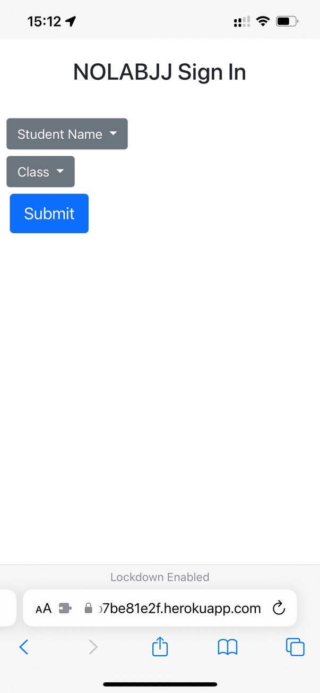
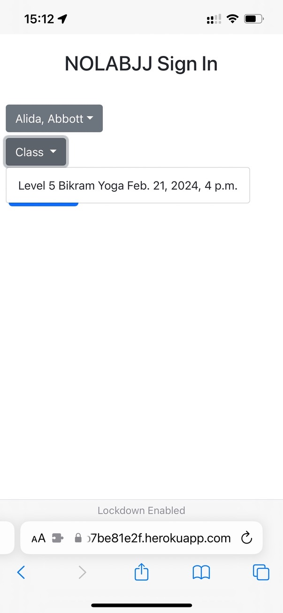
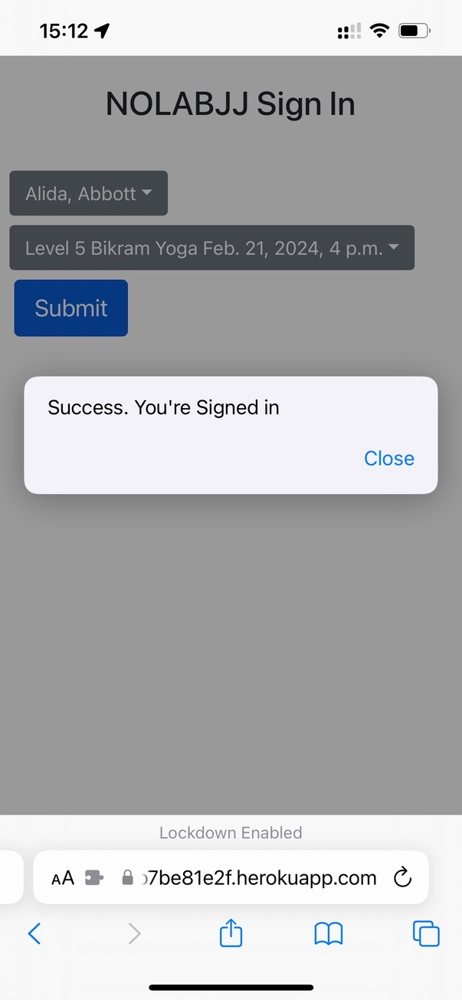

# EasyGymCheckin
EasyGymCheckin is a Django webapp wrapper for the MindBody API to facilitate checking in to a MindyBody gym without
logging in. EasyGymCheckin allows a client to check in to MindBody via their phone without an app. We perform basic sanity
checking that the class is available, the student it active, the class time is soon, and that the student is near the gym


# Quick Start

## Clone the repository
```
gh repo clone mwollenweber/MindBodyCheckin
cd MindBodyCheckin

```

## Configure your Python environment

```bash
source MindBodyCheckin.rc
virtualenv env
source env/bin/activate
pip install -r requirements.txt
```

## Run Celery
```
./run_celery.sh &
./run_celery_beat.sh &
```

## Run the server
```
python manage.py runserver
```


## Screenshots









# License
Copyright Matthew Wollenweber. All rights reserved.


